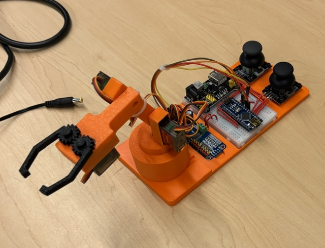

# Mini Robot Arm Controller

### Summer STEM Camp 2026 Robotics Project

A hands-on robotics project designed for Summer STEM Camp 2026. Students assemble a fully functional 4-degree-of-freedom robotic arm using 3D-printed components, SG90 servo motors, an Arduino Nano, and a PCA9685 servo driver. The arm is controlled using two analog joysticks and is used in a final robotics competition where teams complete challenges requiring precision, speed, and strategy.

---

## Project Overview

This project introduces students to the fundamentals of:

* Mechanical Engineering
* Electrical Engineering
* Embedded Systems
* Programming
* Robotics

Students begin with a kit containing:

* 3D-printed robot arm components
* Arduino Nano
* PCA9685 Servo Driver
* 4 × SG90 Micro Servos
* 2 × Analog Joysticks
* Breadboard and jumper wires

Throughout the workshop, students:

1. Assemble the mechanical structure of the robotic arm.
2. Install and mount servo motors.
3. Wire the servos and controller electronics.
4. Upload and test Arduino code.
5. Modify robot behavior through software.
6. Compete in a robotics challenge using their completed arm.

---

## Robot Specifications

| Feature              | Value                         |
| -------------------- | ----------------------------- |
| Degrees of Freedom   | 4                             |
| Controller           | Arduino Nano                  |
| Servo Driver         | PCA9685 16-Channel PWM Driver |
| Servos               | SG90 Micro Servos             |
| User Input           | Dual Analog Joysticks         |
| Communication        | I2C                           |
| Programming Language | Arduino C/C++                 |

---

## Degrees of Freedom

The robotic arm provides four independently controlled movements:

| Function        | Description                     |
| --------------- | ------------------------------- |
| Turret Rotation | Rotates the base left and right |
| Lift Arm        | Raises and lowers the arm       |
| Reach Arm       | Extends and retracts the arm    |
| Gripper         | Opens and closes the claw       |

---

## Control Layout

### Joystick 1

| Axis | Arduino Pin | Function        |
| ---- | ----------- | --------------- |
| VRy  | A0          | Turret Rotation |
| VRx  | A1          | Lift Arm        |

### Joystick 2

| Axis | Arduino Pin | Function  |
| ---- | ----------- | --------- |
| VRy  | A2          | Gripper   |
| VRx  | A3          | Reach Arm |

---

## Servo Assignments

| PCA9685 Channel | Function        |
| --------------- | --------------- |
| Channel 0       | Turret Rotation |
| Channel 1       | Lift Arm        |
| Channel 2       | Reach Arm       |
| Channel 3       | Gripper         |

---

## Hardware Setup

### Arduino Connections

| Arduino Nano | Connection       |
| ------------ | ---------------- |
| A0           | Joystick 1 VRy   |
| A1           | Joystick 1 VRx   |
| A2           | Joystick 2 VRy   |
| A3           | Joystick 2 VRx   |
| A4           | PCA9685 SDA      |
| A5           | PCA9685 SCL      |
| D7           | Joystick 2 Power |
| D8           | Joystick 1 Power |
| GND          | Common Ground    |

### PCA9685 Connections

| PCA9685 Pin        | Connection    |
| ------------------ | ------------- |
| VCC                | Arduino 5V    |
| GND                | Common Ground |
| SDA                | Arduino A4    |
| SCL                | Arduino A5    |
| Servo Channels 0–3 | SG90 Servos   |

> **Important:** Servos should be powered using an appropriate external power source when possible. Powering multiple servos directly from the Arduino can cause instability and unexpected resets.

---

## Required Software

### Arduino IDE

Install the Arduino IDE and configure support for the Arduino Nano.

### Required Library

Install the following library through the Arduino Library Manager:

**Adafruit PWM Servo Driver Library**

This library allows the Arduino Nano to communicate with the PCA9685 servo driver over I2C.

---

## How the Program Works

The program continuously reads all four joystick axes and converts joystick movement into servo motion.

### Features

* Proportional joystick control
* Adjustable movement speed
* Adjustable travel limits
* Servo direction reversal
* Deadzone filtering to prevent drift
* Smooth servo movement

Each joystick axis is associated with a servo and updates that servo's position based on how far the joystick is moved from its center position.

---

## Customization

One goal of the workshop is to encourage experimentation and optimization.

Students can modify several variables in the code to change how the robot behaves.

### Servo Speed

```cpp
const float speed[] = {0.6, 0.6, 0.3, 0.6};
```

Increasing a value makes the servo move faster.

Decreasing a value provides finer control and precision.

### Servo Limits

```cpp
const int minAngle[] = {2, 0, 45, 2};
const int maxAngle[] = {160, 90, 145, 160};
```

These values define safe operating ranges for each servo.

### Servo Direction

```cpp
const int direction[] = {1, -1, 1, 1};
```

Use:

* `1` for normal movement
* `-1` for reversed movement

### Deadzone

```cpp
const int DEADZONE = 40;
```

Larger values reduce sensitivity near the joystick center and help eliminate unwanted drift.

---

## Competition Challenge

After completing assembly and testing, teams participate in a robotics challenge using their robotic arms.

Success depends on:

* Mechanical assembly quality
* Wiring accuracy
* Software tuning
* Driver skill
* Strategic optimization

Students are encouraged to adjust servo speeds and control settings to find the best balance between precision and speed for the competition objectives.

---

## Learning Outcomes

By completing this project, students gain experience with:

### Mechanical Engineering

* Servo mounting
* Mechanical linkages
* Degrees of freedom
* Assembly techniques

### Electrical Engineering

* Circuit wiring
* Power distribution
* PWM signals
* I2C communication

### Programming

* Variables and arrays
* Loops and conditionals
* Sensor input
* Actuator control
* Embedded systems development

### Robotics

* Motion control
* Human-machine interfaces
* System integration
* Design tradeoffs

---

## Project Gallery

### Completed Robot Arm



### Assembly Process

*(Insert build photos here)*

### Competition Day

*(Insert competition photos here)*

---

## Future Improvements

Possible enhancements include:

* Preset arm positions
* Object sorting routines
* Autonomous operation
* OLED status display
* Wireless control
* Record-and-playback functionality
* Inverse kinematics

---

## Acknowledgments

Developed for Summer STEM Camp 2026 as an educational robotics platform designed to introduce students to engineering, programming, and robotics through hands-on learning and competition.
